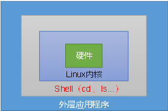

# Shell是什么

Shell是一个命令行解释器，它接收应用程序或者是用户的命令，然后调用操作系统的内核。同时Shell还是一个功能强大、容易编写、调试方便、灵活性强的编程语言。




# helloworld

先来一个helloworld吧,脚本名称helloworld.sh

```shell
#!/bin/bash
echo "hello world!"
```


shell脚本执行有两种方式，一种是通过解释器来执行，一种是自己执行，不同处在于通过解释器来执行不需要可执行权限，而自己执行的话脚本需要有可执行权限。


## 解释器执行

1. sh+脚本的相对路径

   ```shell
   sh helloworld.sh
   ```

   

2. sh+脚本的绝对路径

   ```shell
   sh /whl/shell/helloworld.sh
   ```

   

3. bash+脚本的相对路径

   ```shell
   bash helloworld.sh
   ```

   

4. bash+脚本的绝对路径

   ```shell
   bash /whl/shell/helloworld.sh
   ```


执行效果都是一样的：

```
helloworld
```


## 自己执行

如果选择自己来执行Shell脚本，那么首先要赋予脚本可执行权限，否则将会出现如下错误:

```
[root@iz2zegdhs7pd191av8n8dmz shell]# ./helloworld.sh
bash: ./helloworld.sh: Permission denied
```


赋予脚本可执行权限：

```shell
chmod 777 helloworld.sh
```


执行脚本：

相对路径：

```
./helloworld.sh
```


绝对路径：

```
/whl/shell/helloworld.sh
```


## 升级版helloworld

使用Shell脚本在/whl/shell/helloworld目录下创建一个hello.txt,并且在文件中增加“hello world ！”

```shell
#!/bin/bash
cd /whl/shell/helloworld
touch hello.txt
echo "hello world !" >> hello.txt
```


执行sh helloworld.sh,然后会发现/whl/shell/helloworld目录下多了一个hello.txt文件,

然后执行cat hello.txt命令:

```shell
[root@iz2zegdhs7pd191av8n8dmz helloworld]# ./helloworld.sh
[root@iz2zegdhs7pd191av8n8dmz helloworld]# ls -l
total 8
-rw-r--r-- 1 root root  14 Sep  2 21:45 hello.txt
-rwxrwxrwx 1 root root 108 Sep  2 21:45 helloworld.sh
[root@iz2zegdhs7pd191av8n8dmz helloworld]# cat hello.txt
hello world !
```


# Shell中的变量

## 系统变量

Shell中常用的系统变量有$HOME 、$PWD、$SHELL、$USER等等

1. 查看当前Shell中所有变量

   ```shell
   [root@iz2zegdhs7pd191av8n8dmz variable]# set
   BASH=/usr/bin/bash
   BASHOPTS=checkwinsize:cmdhist:expand_aliases:extquote:force_fignore:histappend:hostcomplete:interactive_comments:progcomp:promptvars:sourcepath
   BASH_ALIASES=()
   BASH_ARGC=()
   BASH_ARGV=()
   BASH_CMDS=()
   BASH_LINENO=()
   BASH_SOURCE=()
   BASH_VERSINFO=([0]="4" [1]="2" [2]="46" [3]="2" [4]="release" [5]="x86_64-redhat-linux-gnu")
   BASH_VERSION='4.2.46(2)-release'
   CLASSPATH=/usr/local/jdk/lib/
   COLUMNS=191
   DIRSTACK=()
   ERLANG_HOME=/usr/local/lib/erlang
   EUID=0
   GIT_HOME=/usr/local/git
   GROUPS=()
   HISTCONTROL=ignoredups
   HISTFILE=/root/.bash_history
   HISTFILESIZE=1000
   HISTSIZE=1000
   HOME=/root
   HOSTNAME=iz2zegdhs7pd191av8n8dmz
   HOSTTYPE=x86_64
   ID=0
   IFS=$' \t\n'
   JAVA_HOME=/usr/local/jdk
   LANG=en_US.UTF-8
   LESSOPEN='||/usr/bin/lesspipe.sh %s'
   LINES=35
   LOGNAME=whl
   LS_COLORS='rs=0:di=01;34:ln=01;36:mh=00:pi=40;33:so=01;35:do=01;35:bd=40;33;01:cd=40;33;01:or=40;31;01:mi=01;05;37;41:su=37;41:sg=30;43:ca=30;41:tw=30;42:ow=34;42:st=37;44:ex=01;32:*.tar=01;31:*.tgz=01;31:*.arc=01;31:*.arj=01;31:*.taz=01;31:*.lha=01;31:*.lz4=01;31:*.lzh=01;31:*.lzma=01;31:*.tlz=01;31:*.txz=01;31:*.tzo=01;31:*.t7z=01;31:*.zip=01;31:*.z=01;31:*.Z=01;31:*.dz=01;31:*.gz=01;31:*.lrz=01;31:*.lz=01;31:*.lzo=01;31:*.xz=01;31:*.bz2=01;31:*.bz=01;31:*.tbz=01;31:*.tbz2=01;31:*.tz=01;31:*.deb=01;31:*.rpm=01;31:*.jar=01;31:*.war=01;31:*.ear=01;31:*.sar=01;31:*.rar=01;31:*.alz=01;31:*.ace=01;31:*.zoo=01;31:*.cpio=01;31:*.7z=01;31:*.rz=01;31:*.cab=01;31:*.jpg=01;35:*.jpeg=01;35:*.gif=01;35:*.bmp=01;35:*.pbm=01;35:*.pgm=01;35:*.ppm=01;35:*.tga=01;35:*.xbm=01;35:*.xpm=01;35:*.tif=01;35:*.tiff=01;35:*.png=01;35:*.svg=01;35:*.svgz=01;35:*.mng=01;35:*.pcx=01;35:*.mov=01;35:*.mpg=01;35:*.mpeg=01;35:*.m2v=01;35:*.mkv=01;35:*.webm=01;35:*.ogm=01;35:*.mp4=01;35:*.m4v=01;35:*.mp4v=01;35:*.vob=01;35:*.qt=01;35:*.nuv=01;35:*.wmv=01;35:*.asf=01;35:*.rm=01;35:*.rmvb=01;35:*.flc=01;35:*.avi=01;35:*.fli=01;35:*.flv=01;35:*.gl=01;35:*.dl=01;35:*.xcf=01;35:*.xwd=01;35:*.yuv=01;35:*.cgm=01;35:*.emf=01;35:*.axv=01;35:*.anx=01;35:*.ogv=01;35:*.ogx=01;35:*.aac=01;36:*.au=01;36:*.flac=01;36:*.mid=01;36:*.midi=01;36:*.mka=01;36:*.mp3=01;36:*.mpc=01;36:*.ogg=01;36:*.ra=01;36:*.wav=01;36:*.axa=01;36:*.oga=01;36:*.spx=01;36:*.xspf=01;36:'
   MACHTYPE=x86_64-redhat-linux-gnu
   MAIL=/var/spool/mail/whl
   MAILCHECK=60
   MAVEN_HOME=/usr/local/maven
   OLDPWD=/whl/shell
   OPTERR=1
   OPTIND=1
   OSTYPE=linux-gnu
   PATH=/usr/local/lib/erlang/bin:/usr/local/bin:/usr/bin:/usr/local/sbin:/usr/sbin:/usr/local/jdk/bin:/usr/local/maven/bin:/usr/local/git/bin:/home/whl/.local/bin:/home/whl/bin
   PIPESTATUS=([0]="0")
   PPID=1204
   PROMPT_COMMAND='printf "\033]0;%s@%s:%s\007" "${USER}" "${HOSTNAME%%.*}" "${PWD/#$HOME/~}"'
   PS1='[\u@\h \W]\$ '
   PS2='> '
   PS4='+ '
   PWD=/whl/shell/variable
   SHELL=/bin/bash
   SHELLOPTS=braceexpand:emacs:hashall:histexpand:history:interactive-comments:monitor
   SHLVL=2
   SSH_CLIENT='101.88.251.35 23363 22'
   SSH_CONNECTION='101.88.251.35 23363 172.17.148.69 22'
   SSH_TTY=/dev/pts/0
   TERM=xterm
   UID=0
   USER=whl
   XDG_RUNTIME_DIR=/run/user/1000
   XDG_SESSION_ID=8304
   _=system_v.sh
   colors=/root/.dircolors
   _rabbitmqctl_complete () 
   { 
       if [ -x /usr/lib/rabbitmq/bin/rabbitmqctl ]; then
           COMPREPLY=();
           local LANG=en_US.UTF-8;
           local word="${COMP_WORDS[COMP_CWORD]}";
           local completions="$(export LANG=en_US.UTF-8; export LC_CTYPE=en_US.UTF-8; /usr/lib/rabbitmq/bin/rabbitmqctl --auto-complete $COMP_LINE)";
           COMPREPLY=($(compgen -W "$completions" -- "$word"));
       fi
   }
   
   ```

   


2. 使用系统变量,创建system_v.sh脚本：

   ```shell
     1 #!/bin/bash
     2 echo $HOME
     3 echo $PWD
     4 echo $SHELL
     5 echo $USER
   ```

   执行脚本

   ```shell
   [root@iz2zegdhs7pd191av8n8dmz variable]# sh system_v.sh
   /root
   /whl/shell/variable
   /bin/bash
   whl
   ```

   


## 自定义变量

### 基本语法

（1）定义变量：变量=值 

（2）撤销变量：unset 变量

（3）声明静态变量：readonly 变量，注意：不能unset


### 变量定义规则

（1）变量名称可以由字母、数字和下划线组成，但是不能以数字开头，环境变量名建议大写。

（2）等号两侧不能有空格

（3）在bash中，变量默认类型都是字符串类型，无法直接进行数值运算。

（4）变量的值如果有空格，需要使用双引号或单引号括起来。


### 案例

案例一,定义变量：

```shell
[root@iz2zegdhs7pd191av8n8dmz variable]# name=whl
[root@iz2zegdhs7pd191av8n8dmz variable]# echo $name
whl
```


案例二，撤销变量

```shell
[root@iz2zegdhs7pd191av8n8dmz variable]# name=whl
[root@iz2zegdhs7pd191av8n8dmz variable]# echo $name
whl
[root@iz2zegdhs7pd191av8n8dmz variable]# unset name
[root@iz2zegdhs7pd191av8n8dmz variable]# echo $name

[root@iz2zegdhs7pd191av8n8dmz variable]# 

```


案例三，声明静态变量

```shell
[root@iz2zegdhs7pd191av8n8dmz variable]# readonly name=whl
[root@iz2zegdhs7pd191av8n8dmz variable]# echo $name
whl
```


案例四，撤销静态变量

```shell
[root@iz2zegdhs7pd191av8n8dmz variable]# readonly name=whl
[root@iz2zegdhs7pd191av8n8dmz variable]# echo $name
whl
[root@iz2zegdhs7pd191av8n8dmz variable]# unset name
bash: unset: name: cannot unset: readonly variable
```


案例五，尝试以数字开头定义一个变量

```shell
[root@iz2zegdhs7pd191av8n8dmz variable]# count=1
[root@iz2zegdhs7pd191av8n8dmz variable]# echo $count
1
[root@iz2zegdhs7pd191av8n8dmz variable]# 1count=1
bash: 1count=1: command not found
```


案例五，尝试定义变量时在等号两边加上空格

```shell
[root@iz2zegdhs7pd191av8n8dmz variable]# blank = b
bash: blank: command not found
```


案例六，尝试定义变量时进行数值计算

```shell
[root@iz2zegdhs7pd191av8n8dmz variable]# sum=1+2
[root@iz2zegdhs7pd191av8n8dmz variable]# echo $sum
1+2
```


案例七，尝试创建含有空格的变量

```shell
[root@iz2zegdhs7pd191av8n8dmz variable]# blank=I Love You
bash: Love: command not found
[root@iz2zegdhs7pd191av8n8dmz variable]# blank="I Love You"
[root@iz2zegdhs7pd191av8n8dmz variable]# echo $blank
I Love You
```


案例八,将变量提升为全局变量供其他shell脚本使用

提升方法： export 变量

```shell
[root@iz2zegdhs7pd191av8n8dmz variable]# v=hello
[root@iz2zegdhs7pd191av8n8dmz variable]# touch variable.sh
[root@iz2zegdhs7pd191av8n8dmz variable]# vim variable.sh
[root@iz2zegdhs7pd191av8n8dmz variable]# cat variable.sh
#!/bin/bash
echo $PWD
echo $v
[root@iz2zegdhs7pd191av8n8dmz variable]# sh variable.sh
/whl/shell/variable

[root@iz2zegdhs7pd191av8n8dmz variable]# export v
[root@iz2zegdhs7pd191av8n8dmz variable]# sh variable.sh
/whl/shell/variable
hello
```


## 特殊变量

Shell中的特殊变量有$n、$#、$*、$@、$？等等

### $n

功能描述：n为数字，$0代表该脚本名称，$1-$9代表第一到第九个参数，十以上的参数，十以上的参数需要用大括号包含，如${10}

```shell
[root@iz2zegdhs7pd191av8n8dmz parameter]# touch parameter.sh
[root@iz2zegdhs7pd191av8n8dmz parameter]# vim  parameter.sh
[root@iz2zegdhs7pd191av8n8dmz parameter]# cat parameter.sh
#!/bin/bash
echo "$0  $1   $2"
[root@iz2zegdhs7pd191av8n8dmz parameter]# sh  parameter.sh hello world
parameter.sh  hello   world
```


### $#

功能描述：获取所有输入参数个数，常用于循环

```shell
[root@iz2zegdhs7pd191av8n8dmz parameter]# vim parameter.sh
[root@iz2zegdhs7pd191av8n8dmz parameter]# cat parameter.sh
#!/bin/bash
echo "$0  $1   $2"
echo $#
[root@iz2zegdhs7pd191av8n8dmz parameter]# sh parameter.sh hello world !
parameter.sh  hello   world
3
[root@iz2zegdhs7pd191av8n8dmz parameter]# sh parameter.sh hello world 2 !
parameter.sh  hello   world
4
```


### $*和$@

功能描述：

$* 和$@这两个变量都代表命令行中所有的参数，不同的是$*把所有的参数看成一个整体,$@把每个参数区分对待

```shell
[root@iz2zegdhs7pd191av8n8dmz parameter]# vim parameter.sh
[root@iz2zegdhs7pd191av8n8dmz parameter]# cat parameter.sh
#!/bin/bash
echo "$0  $1   $2"
echo $#
echo $*
echo $@
[root@iz2zegdhs7pd191av8n8dmz parameter]# sh parameter.sh 1 2 3
parameter.sh  1   2
3
1 2 3
1 2 3
```


### $？

功能描述：最后一次执行的命令的返回状态。

如果这个变量的值为0，证明上一个命令正确执行；

如果这个变量的值为非0（具体是哪个数，由命令自己来决定），则证明上一个命令执行不正确了。

```shell
[root@iz2zegdhs7pd191av8n8dmz parameter]# sh parameter.sh 1 2 3
parameter.sh  1   2
3
1 2 3
1 2 3
[root@iz2zegdhs7pd191av8n8dmz parameter]# echo $?
0
[root@iz2zegdhs7pd191av8n8dmz parameter]# sh parameter 1 2 3
sh: parameter: No such file or directory
[root@iz2zegdhs7pd191av8n8dmz parameter]# echo $?
127
```


# Shell中的运算符

## 算术运算符

原生bash不支持简单的数学运算，但是可以通过其他命令来实现，例如 awk 和 expr，expr 最常用。

expr 是一款表达式计算工具，使用它能完成表达式的求值操作，比如两个数相加(**注意使用的是反引号 ` 而不是单引号 '**)。

| 运算符 | 说明                                          | 举例                          |
| :----- | :-------------------------------------------- | :---------------------------- |
| +      | 加法                                          | `expr $a + $b` 结果为 30。    |
| -      | 减法                                          | `expr $a - $b` 结果为 -10。   |
| \*     | 乘法，                                        | `expr $a \* $b` 结果为  200。 |
| /      | 除法                                          | `expr $b / $a` 结果为 2。     |
| %      | 取余                                          | `expr $b % $a` 结果为 0。     |
| =      | 赋值                                          | a=$b 将把变量 b 的值赋给 a。  |
| ==     | 相等。用于比较两个数字，相同则返回 true。     | [ $a == $b ] 返回 false。     |
| !=     | 不相等。用于比较两个数字，不相同则返回 true。 | [ $a != $b ] 返回 true。      |

注意：**expr运算符间要有空格**


```shell
[root@iz2zegdhs7pd191av8n8dmz operator]# vim operator1.sh
[root@iz2zegdhs7pd191av8n8dmz operator]# cat operator1.sh
#!/bin/bash
a=10
b=20

val=`expr $a + $b`
echo "a + b : $val"

val=`expr $a - $b`
echo "a - b : $val"

val=`expr $a \* $b`
echo "a * b : $val"

val=`expr $b / $a`
echo "b / a : $val"

val=`expr $b % $a`
echo "b % a : $val"

if [ $a == $b ]
then
   echo "a 等于 b"
fi
if [ $a != $b ]
then
   echo "a 不等于 b"
fi
[root@iz2zegdhs7pd191av8n8dmz operator]# sh operator1.sh
a + b : 30
a - b : -10
a * b : 200
b / a : 2
b % a : 0
a 不等于 b

```


## 关系运算符

关系运算符只支持数字，不支持字符串，除非字符串的值是数字。

| 运算符 | 说明                                                  | 举例                       |
| :----- | :---------------------------------------------------- | :------------------------- |
| -eq    | 检测两个数是否相等，相等返回 true。                   | [ $a -eq $b ] 返回 false。 |
| -ne    | 检测两个数是否不相等，不相等返回 true。               | [ $a -ne $b ] 返回 true。  |
| -gt    | 检测左边的数是否大于右边的，如果是，则返回 true。     | [ $a -gt $b ] 返回 false。 |
| -lt    | 检测左边的数是否小于右边的，如果是，则返回 true。     | [ $a -lt $b ] 返回 true。  |
| -ge    | 检测左边的数是否大于等于右边的，如果是，则返回 true。 | [ $a -ge $b ] 返回 false。 |
| -le    | 检测左边的数是否小于等于右边的，如果是，则返回 true。 | [ $a -le $b ] 返回 true。  |


```shell
[root@iz2zegdhs7pd191av8n8dmz operator]# vim operator2.sh
[root@iz2zegdhs7pd191av8n8dmz operator]# cat operator2.sh
#!/bin/bash

a=10
b=20

if [ $a -eq $b ]
then
	echo "$a -eq $b : a 等于 b"
else
	echo "$a -eq $b: a 不等于 b"
fi
      
if [ $a -ne $b ]
then
     echo "$a -ne $b: a 不等于 b"
else
	 echo "$a -ne $b : a 等于 b"
fi

if [ $a -gt $b ]
then
	 echo "$a -gt $b: a 大于 b"
else
	 echo "$a -gt $b: a 不大于 b"
fi

if [ $a -lt $b ]
then
    echo "$a -lt $b: a 小于 b"
else
	echo "$a -lt $b: a 不小于 b"
fi
	
if [ $a -ge $b ]
then
	 echo "$a -ge $b: a 大于或等于 b"
else
	 echo "$a -ge $b: a 小于 b"
fi

if [ $a -le $b ]
then
	echo "$a -le $b: a 小于或等于 b"
else 
	echo "$a -le $b: a 大于 b"
fi
			
[root@iz2zegdhs7pd191av8n8dmz operator]# sh operator2.sh
10 -eq 20: a 不等于 b
10 -ne 20: a 不等于 b
10 -gt 20: a 不大于 b
10 -lt 20: a 小于 b
10 -ge 20: a 小于 b
10 -le 20: a 小于或等于 b

```


## 布尔运算符

| 运算符 | 说明                                                | 举例                                     |
| :----- | :-------------------------------------------------- | :--------------------------------------- |
| !      | 非运算，表达式为 true 则返回 false，否则返回 true。 | [ ! false ] 返回 true。                  |
| -o     | 或运算，有一个表达式为 true 则返回 true。           | [ $a -lt 20 -o $b -gt 100 ] 返回 true。  |
| -a     | 与运算，两个表达式都为 true 才返回 true。           | [ $a -lt 20 -a $b -gt 100 ] 返回 false。 |

```shell
[root@iz2zegdhs7pd191av8n8dmz operator]# vim operator3.sh
[root@iz2zegdhs7pd191av8n8dmz operator]# cat operator3.sh
#!/bin/bash

a=10
b=20

if [ $a != $b ]
then
   echo "$a != $b : a 不等于 b"
else
   echo "$a == $b: a 等于 b"
fi
if [ $a -lt 100 -a $b -gt 15 ]
then
    echo "$a 小于 100 且 $b 大于 15 : 返回 true"
else
	echo "$a 小于 100 且 $b 大于 15 : 返回 false"
fi
if [ $a -lt 100 -o $b -gt 100 ]
then
	echo "$a 小于 100 或 $b 大于 100 : 返回 true"
else
	echo "$a 小于 100 或 $b 大于 100 : 返回 false"
fi
if [ $a -lt 5 -o $b -gt 100 ]
then
	echo "$a 小于 5 或 $b 大于 100 : 返回 true"
else
	echo "$a 小于 5 或 $b 大于 100 : 返回 false"
fi
[root@iz2zegdhs7pd191av8n8dmz operator]# sh  operator3.sh
10 != 20 : a 不等于 b
10 小于 100 且 20 大于 15 : 返回 true
10 小于 100 或 20 大于 100 : 返回 true
10 小于 5 或 20 大于 100 : 返回 false
```


## 逻辑运算符

| 运算符 | 说明       | 举例                                       |
| :----- | :--------- | :----------------------------------------- |
| &&     | 逻辑的 AND | [[ $a -lt 100 && $b -gt 100 ]] 返回 false  |
| \|\|   | 逻辑的 OR  | [[ $a -lt 100 \|\| $b -gt 100 ]] 返回 true |

```shell
[root@iz2zegdhs7pd191av8n8dmz operator]# vim operator4.sh
[root@iz2zegdhs7pd191av8n8dmz operator]# cat operator4.sh
#!/bin/bash

a=10
b=20

if [[ $a -lt 100 && $b -gt 100 ]]
then
   echo "返回 true"
else
   echo "返回 false"
fi

if [[ $a -lt 100 || $b -gt 100 ]]
then
   echo "返回 true"
else
   echo "返回 false"
fi
[root@iz2zegdhs7pd191av8n8dmz operator]# sh  operator4.sh
返回 false
返回 true
```


## 字符串运算符

| 运算符 | 说明                                      | 举例                     |
| :----- | :---------------------------------------- | :----------------------- |
| =      | 检测两个字符串是否相等，相等返回 true。   | [ $a = $b ] 返回 false。 |
| !=     | 检测两个字符串是否相等，不相等返回 true。 | [ $a != $b ] 返回 true。 |
| -z     | 检测字符串长度是否为0，为0返回 true。     | [ -z $a ] 返回 false。   |
| -n     | 检测字符串长度是否为0，不为0返回 true。   | [ -n "$a" ] 返回 true。  |
| $      | 检测字符串是否为空，不为空返回 true。     | [ $a ] 返回 true。       |

```shell
[root@iz2zegdhs7pd191av8n8dmz operator]# vim operator5.sh
[root@iz2zegdhs7pd191av8n8dmz operator]# cat operator5.sh
#!/bin/bash
a="abc"
b="efg"

if [ $a = $b ]
then
   echo "$a = $b : a 等于 b"
else
   echo "$a = $b: a 不等于 b"
fi
if [ $a != $b ]
then
   echo "$a != $b : a 不等于 b"
else
   echo "$a != $b: a 等于 b"
fi
if [ -z $a ]
then
   echo "-z $a : 字符串长度为 0"
else
   echo "-z $a : 字符串长度不为 0"
fi
if [ -n "$a" ]
then
   echo "-n $a : 字符串长度不为 0"
else
   echo "-n $a : 字符串长度为 0"
fi
if [ $a ]
then
   echo "$a : 字符串不为空"
else
   echo "$a : 字符串为空"
fi

[root@iz2zegdhs7pd191av8n8dmz operator]# sh  operator5.sh
abc = efg: a 不等于 b
abc != efg : a 不等于 b
-z abc : 字符串长度不为 0
-n abc : 字符串长度不为 0
abc : 字符串不为空
```


## 文件测试运算符

文件测试运算符用于检测 Unix 文件的各种属性。

| 操作符  | 说明                                                         | 举例                      |
| :------ | :----------------------------------------------------------- | :------------------------ |
| -b file | 检测文件是否是块设备文件，如果是，则返回 true。              | [ -b $file ] 返回 false。 |
| -c file | 检测文件是否是字符设备文件，如果是，则返回 true。            | [ -c $file ] 返回 false。 |
| -d file | 检测文件是否是目录，如果是，则返回 true。                    | [ -d $file ] 返回 false。 |
| -f file | 检测文件是否是普通文件（既不是目录，也不是设备文件），如果是，则返回 true。 | [ -f $file ] 返回 true。  |
| -g file | 检测文件是否设置了 SGID 位，如果是，则返回 true。            | [ -g $file ] 返回 false。 |
| -k file | 检测文件是否设置了粘着位(Sticky Bit)，如果是，则返回 true。  | [ -k $file ] 返回 false。 |
| -p file | 检测文件是否是有名管道，如果是，则返回 true。                | [ -p $file ] 返回 false。 |
| -u file | 检测文件是否设置了 SUID 位，如果是，则返回 true。            | [ -u $file ] 返回 false。 |
| -r file | 检测文件是否可读，如果是，则返回 true。                      | [ -r $file ] 返回 true。  |
| -w file | 检测文件是否可写，如果是，则返回 true。                      | [ -w $file ] 返回 true。  |
| -x file | 检测文件是否可执行，如果是，则返回 true。                    | [ -x $file ] 返回 true。  |
| -s file | 检测文件是否为空（文件大小是否大于0），不为空返回 true。     | [ -s $file ] 返回 true。  |
| -e file | 检测文件（包括目录）是否存在，如果是，则返回 true。          | [ -e $file ] 返回 true。  |

```shell
[root@iz2zegdhs7pd191av8n8dmz operator]# vim operator6.sh
[root@iz2zegdhs7pd191av8n8dmz operator]# cat operator6.sh
#!/bin/bash

file="/whl/shell/operator/test.sh"
if [ -r $file ]
then
   echo "文件可读"
else
   echo "文件不可读"
fi
if [ -w $file ]
then
   echo "文件可写"
else
   echo "文件不可写"
fi
if [ -x $file ]
then
   echo "文件可执行"
else
   echo "文件不可执行"
fi
if [ -f $file ]
then
   echo "文件为普通文件"
else
   echo "文件为特殊文件"
fi
if [ -d $file ]
then
   echo "文件是个目录"
else
   echo "文件不是个目录"
fi
if [ -s $file ]
then
   echo "文件不为空"
else
   echo "文件为空"
fi
if [ -e $file ]
then
   echo "文件存在"
else
   echo "文件不存在"
fi
[root@iz2zegdhs7pd191av8n8dmz operator]# sh  operator6.sh
文件可读
文件可写
文件可执行
文件为普通文件
文件不是个目录
文件不为空
文件存在
```


# Shell中的流程控制

## if判断

if语句语法格式：

```shell
if condition
then
    command1 
    command2
    ...
    commandN 
fi
```


if-else语句语法格式：

```shell
if condition
then
    command1 
    command2
    ...
    commandN
else
    command
fi
```

注意:**如果else分支中没有语句执行，就不要加else分支**


if else-if else语句语法格式:

```shell
if condition1
then
    command1
elif condition2 
then 
    command2
else
    commandN
fi
```


```shell
[root@iz2zegdhs7pd191av8n8dmz flowcontrol]# vim if.sh
[root@iz2zegdhs7pd191av8n8dmz flowcontrol]# cat if.sh
#!/bin/bash

a=10
b=20
c=10

if [ $a -eq $c ]
then
	echo "a -eq c is true"
fi

if [ $a -eq $b ]
then
	echo "a -eq b is true"
else 
	echo "a -eq b is false"
fi

if [ $a -eq $b ]
then 
	echo "a -eq b is true"
elif [ $b -eq $c ]
then 
	echo "b -eq c is true"
else
	echo "a -eq b is false,b -eq c is false"
fi
	
[root@iz2zegdhs7pd191av8n8dmz flowcontrol]# sh if.sh
a -eq c is true
a -eq b is false
a -eq b is false,b -eq c is false

```


## for循环

for循环一般格式为：

```shell
for var in item1 item2 ... itemN
do
    command1
    command2
    ...
    commandN
done
```


for循环输出数字:

```shell
[root@iz2zegdhs7pd191av8n8dmz flowcontrol]# vim for.sh
[root@iz2zegdhs7pd191av8n8dmz flowcontrol]# cat for.sh
#!/bin/bash
for loop in 1 2 3 4 5
do
    echo "The value is: $loop"
done
[root@iz2zegdhs7pd191av8n8dmz flowcontrol]# sh for.sh
The value is: 1
The value is: 2
The value is: 3
The value is: 4
The value is: 5
```


for循环输出字符串中的字符:

```shell
[root@iz2zegdhs7pd191av8n8dmz flowcontrol]# vim for2.sh
[root@iz2zegdhs7pd191av8n8dmz flowcontrol]# cat for2.sh
#!/bin/bash
for loop in "I LOVE YOU !"
do
    echo  $loop
done

for loop in I LOVE YOU !
do
    echo  $loop
done

[root@iz2zegdhs7pd191av8n8dmz flowcontrol]# sh for2.sh
I LOVE YOU !
I
LOVE
YOU
!
```


## while循环

while循环用于不断执行一系列命令，也用于从输入文件中读取数据；命令通常为测试条件。其格式为：

```shell
while condition
do
    command
done
```


案例:

```shell
[root@iz2zegdhs7pd191av8n8dmz flowcontrol]# vim while.sh
[root@iz2zegdhs7pd191av8n8dmz flowcontrol]# cat while.sh
#!/bin/bash

count=1
while(( $count <= 5 ))
do
    echo $count
    let "count++"
done
[root@iz2zegdhs7pd191av8n8dmz flowcontrol]# sh while.sh
1
2
3
4
5
```

Bash let 命令用于执行一个或多个表达式，变量计算中不需要加上 $ 来表示变量


## until循环

until 循环执行一系列命令直至条件为 true 时停止, until 循环与 while 循环在处理方式上刚好相反。

语法格式:

```shell
until condition
do
    command
done
```

condition 一般为条件表达式，**如果返回值为 false，则继续执行循环体内的语句，否则跳出循环**。


案例：

```shell
[root@iz2zegdhs7pd191av8n8dmz flowcontrol]# vim until.sh
[root@iz2zegdhs7pd191av8n8dmz flowcontrol]# cat until.sh
#!/bin/bash

a=0

until [ ! $a -lt 10 ]
do
   echo $a
   a=`expr $a + 1`
done
[root@iz2zegdhs7pd191av8n8dmz flowcontrol]# sh until.sh
0
1
2
3
4
5
6
7
8
9
```


## case语句

Shell case语句为多选择语句。可以用case语句匹配一个值与一个模式，如果匹配成功，执行相匹配的命令。

case语句格式：

```shell
case 值 in
模式1)
    command
    ;;
模式2）
    command
    ;;
esac
```

case工作方式如上所示。取值后面必须为单词in，每一模式必须以右括号结束。取值可以为变量或常数。匹配发现取值符合某一模式后，其间所有命令开始执行直至 ;;。

取值将检测匹配的每一个模式。一旦模式匹配，则执行完匹配模式相应命令后不再继续其他模式。如果无一匹配模式，使用星号 * 捕获该值，再执行后面的命令。


案例:

```shell
[root@iz2zegdhs7pd191av8n8dmz flowcontrol]# vim case.sh
[root@iz2zegdhs7pd191av8n8dmz flowcontrol]# cat case.sh
#!/bin/bash

echo '输入 1 到 4 之间的数字:'
echo '你输入的数字为:'
read aNum
case $aNum in
    1)  echo '你选择了 1'
        ;;
    2)  echo '你选择了 2'
	;;
    3)  echo '你选择了 3'
        ;;
    4)  echo '你选择了 4'
        ;;
    *)  echo '你没有输入 1 到 4 之间的数字'
	;;
esac
[root@iz2zegdhs7pd191av8n8dmz flowcontrol]# sh case.sh
输入 1 到 4 之间的数字:
你输入的数字为:
5
你没有输入 1 到 4 之间的数字
[root@iz2zegdhs7pd191av8n8dmz flowcontrol]# sh case.sh
输入 1 到 4 之间的数字:
你输入的数字为:
2
你选择了 2
```


## break和continue

在循环过程中，有时候需要在未达到循环结束条件时强制跳出循环，Shell使用两个命令来实现该功能：break和continue。

break命令允许跳出所有循环（终止执行后面的所有循环）。

continue命令与break命令类似，只有一点差别，它不会跳出所有循环，仅仅跳出当前循环。


break命令案例：

```shell
[root@iz2zegdhs7pd191av8n8dmz flowcontrol]# vim break.sh
[root@iz2zegdhs7pd191av8n8dmz flowcontrol]# cat break.sh
#!/bin/bash
while :
do
    echo -n "输入 1 到 5 之间的数字:"
    read aNum
    case $aNum in
	 1|2|3|4|5) 
	 	echo "你输入的数字为 $aNum!"
		;;
	*)
		echo "你输入的数字不是 1 到 5 之间的! "
	        break
		;;
   esac
done
[root@iz2zegdhs7pd191av8n8dmz flowcontrol]# sh break.sh
输入 1 到 5 之间的数字:6
你输入的数字不是 1 到 5 之间的! 
[root@iz2zegdhs7pd191av8n8dmz flowcontrol]# sh break.sh
输入 1 到 5 之间的数字:3
你输入的数字为 3!
输入 1 到 5 之间的数字:2
你输入的数字为 2!
输入 1 到 5 之间的数字:1
你输入的数字为 1!
输入 1 到 5 之间的数字:4
你输入的数字为 4!
输入 1 到 5 之间的数字:
```


continue命令案例:

```shell
[root@iz2zegdhs7pd191av8n8dmz flowcontrol]# vim continue.sh
[root@iz2zegdhs7pd191av8n8dmz flowcontrol]# cat continue.sh
#!/bin/bash 
while :
do   
	echo -n "输入 1 到 5 之间的数字: "     
read aNum     
case $aNum in         
	1|2|3|4|5) 
		echo "你输入的数字为 $aNum!"         
		;;         
	*) 
		echo "你输入的数字不是 1 到 5 之间的!"             
		continue                      
		;;     
esac 
done
[root@iz2zegdhs7pd191av8n8dmz flowcontrol]# sh continue.sh
输入 1 到 5 之间的数字: 1
你输入的数字为 1!
输入 1 到 5 之间的数字: 2
你输入的数字为 2!
输入 1 到 5 之间的数字: 3
你输入的数字为 3!
输入 1 到 5 之间的数字: 4
你输入的数字为 4!
输入 1 到 5 之间的数字: 5
你输入的数字为 5!
输入 1 到 5 之间的数字: 6
你输入的数字不是 1 到 5 之间的!
输入 1 到 5 之间的数字: 7
你输入的数字不是 1 到 5 之间的!
输入 1 到 5 之间的数字: 8
你输入的数字不是 1 到 5 之间的!
输入 1 到 5 之间的数字: 9
你输入的数字不是 1 到 5 之间的!
输入 1 到 5 之间的数字: 
```


# Shell中的函数

Shell中的函数有两种，一种是系统函数，一种是自定义函数


## 系统函数


## 自定义函数


