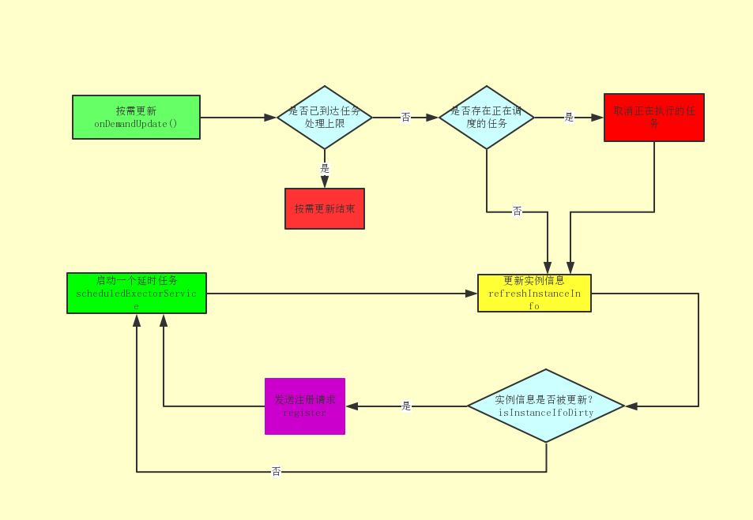

# InstanceInfoReplicator.run()

通过上一篇对DiscoveryClient的简单介绍，我们知道了DiscoveryClient通过创建了一个InstanceInfoReplicator线程实例，然后又在该线程中调用了register方法实现了服务注册。

```java
class InstanceInfoReplicator implements Runnable {
    private static final Logger logger = LoggerFactory.getLogger(InstanceInfoReplicator.class);

    private final DiscoveryClient discoveryClient;
    private final InstanceInfo instanceInfo;

    private final int replicationIntervalSeconds;
    private final ScheduledExecutorService scheduler;
    private final AtomicReference<Future> scheduledPeriodicRef;

    private final AtomicBoolean started;
    private final RateLimiter rateLimiter;
    private final int burstSize;
    private final int allowedRatePerMinute;

    InstanceInfoReplicator(DiscoveryClient discoveryClient, InstanceInfo instanceInfo, int replicationIntervalSeconds, int burstSize) {
        this.discoveryClient = discoveryClient;
        this.instanceInfo = instanceInfo;
        this.scheduler = Executors.newScheduledThreadPool(1,
                new ThreadFactoryBuilder()
                        .setNameFormat("DiscoveryClient-InstanceInfoReplicator-%d")
                        .setDaemon(true)
                        .build());

        this.scheduledPeriodicRef = new AtomicReference<Future>();

        this.started = new AtomicBoolean(false);
        this.rateLimiter = new RateLimiter(TimeUnit.MINUTES);
        this.replicationIntervalSeconds = replicationIntervalSeconds;
        this.burstSize = burstSize;

        this.allowedRatePerMinute = 60 * this.burstSize / this.replicationIntervalSeconds;
        logger.info("InstanceInfoReplicator onDemand update allowed rate per min is {}", allowedRatePerMinute);
    }
    
    /**
     * 中间省略.....
     */

    public void start(int initialDelayMs) {
        if (started.compareAndSet(false, true)) {
            instanceInfo.setIsDirty();  // for initial register
            Future next = scheduler.schedule(this, initialDelayMs, TimeUnit.SECONDS);
            scheduledPeriodicRef.set(next);
        }
    }
    
    
    /**
     * 末尾省略.....
     */
}
```

InstanceInfoReplicator的作用有两个，一是更新本地的InstanceInfo,二是将本地的InstanceInfo复制到Eureka Server去，InstanceInfoReplicator有以下几个特性:

1. 它使用单个更新线程来保证InstanceInfo的有序更新，为什么要使用单线程来更新呢？因为这样可以避免多线程并发时可能会出现的新旧状态顺序错乱问题，比如说现在本地的InstanceInfo被更新了，假设更新成状态A，然后会有一个请求A，将状态A复制到EurekaServer，但是这个请求发出以后InstanceInfo的状态又发生了改变，变成了状态B,在多线程的情况下，可能马上又会发出一个请求B，要将状态B复制到Eureka Server，但是呢，这个请求A到达Eureka Server的时间可能比请求B更晚，这样话可能就会导致Eureka Server和Eureka Client的状态不一致。而使用单线程来处理的话，一次只能处理一个请求，就可以避免这个问题，降低代码的复杂度。
2. 可以通过onDemandUpdate方法来按需调用更新任务。
3. 任务处理的速率受到burstSize的限制。每分钟允许的频率=60*burst/replicationIntervalSeconds(默认30s).
4. 新的更新任务总是在较早的更新任务之后自动调度。但是，如果启动了随需应变任务，则会丢弃调度的自动更新任务(并在新的随需应变更新之后调度新的自动更新任务)。

根据InstanceInfoReplicator的源码可以看出，它实现了Runnable接口，并且在它的构造方法内创建了一个定时器，并且在它的start方法内部启动了这个定时器，任务线程就是它自己。

再来看看它的run方法都做了什么:

```java
    public void run() {
        try {
            //更新实例信息
            discoveryClient.refreshInstanceInfo();
			
            //如果当前实例信息有更新，发送注册请求
            Long dirtyTimestamp = instanceInfo.isDirtyWithTime();
            if (dirtyTimestamp != null) {
                discoveryClient.register();
                instanceInfo.unsetIsDirty(dirtyTimestamp);
            }
        } catch (Throwable t) {
            logger.warn("There was a problem with the instance info replicator", t);
        } finally {
            //执行完run方法的逻辑以后，再启动一个定时任务，延时replicationIntervalSeconds执行(默认30s)
            Future next = scheduler.schedule(this, replicationIntervalSeconds, TimeUnit.SECONDS);
            scheduledPeriodicRef.set(next);
        }
    }
```

我们可以看出它的内部做了两个事:

> discoveryClient.refreshInstanceInfo();

以及

> discoveryClient.register();

refreshInstanceInfo()方法的作用是更新当前本地实例讯息

```java
    void refreshInstanceInfo() {
        //更新数据中心信息，本地的hostname发生了改变才会更新
        applicationInfoManager.refreshDataCenterInfoIfRequired();
        //如果租约过期时间和心跳频率有变化则更新租约信息
        applicationInfoManager.refreshLeaseInfoIfRequired();

        //更新服务状态
        InstanceStatus status;
        try {
            status = getHealthCheckHandler().getStatus(instanceInfo.getStatus());
        } catch (Exception e) {
            logger.warn("Exception from healthcheckHandler.getStatus, setting status to DOWN", e);
            //如果获取状态发生异常，将当前服务的状态设置为DOWN
            status = InstanceStatus.DOWN;
        }

        if (null != status) {
            //设置服务状态
            applicationInfoManager.setInstanceStatus(status);
        }
    }
    
    ------------------------------------------------
    
    //如果hostname发生了改变，更新数据中心信息
    public void refreshDataCenterInfoIfRequired() {
        String existingAddress = instanceInfo.getHostName();

        String newAddress;
        if (config instanceof RefreshableInstanceConfig) {
            // Refresh data center info, and return up to date address
            newAddress = ((RefreshableInstanceConfig) config).resolveDefaultAddress(true);
        } else {
            newAddress = config.getHostName(true);
        }
        String newIp = config.getIpAddress();

        if (newAddress != null && !newAddress.equals(existingAddress)) {
            logger.warn("The address changed from : {} => {}", existingAddress, newAddress);

            // :( in the legacy code here the builder is acting as a mutator.
            // This is hard to fix as this same instanceInfo instance is referenced elsewhere.
            // We will most likely re-write the client at sometime so not fixing for now.
            InstanceInfo.Builder builder = new InstanceInfo.Builder(instanceInfo);
            builder.setHostName(newAddress).setIPAddr(newIp).setDataCenterInfo(config.getDataCenterInfo());
            instanceInfo.setIsDirty();
        }
    }
    
    //如果租约过期时间（默认90s）和心跳频率（默认30s）发生了变化
    //更新租约信息
    public void refreshLeaseInfoIfRequired() {
        LeaseInfo leaseInfo = instanceInfo.getLeaseInfo();
        if (leaseInfo == null) {
            return;
        }
        int currentLeaseDuration = config.getLeaseExpirationDurationInSeconds();
        int currentLeaseRenewal = config.getLeaseRenewalIntervalInSeconds();
        if (leaseInfo.getDurationInSecs() != currentLeaseDuration || leaseInfo.getRenewalIntervalInSecs() != currentLeaseRenewal) {
            LeaseInfo newLeaseInfo = LeaseInfo.Builder.newBuilder()
                    .setRenewalIntervalInSecs(currentLeaseRenewal)
                    .setDurationInSecs(currentLeaseDuration)
                    .build();
            instanceInfo.setLeaseInfo(newLeaseInfo);
            instanceInfo.setIsDirty();
        }
    }
```

refreshInstanceInfo方法会在必要的时候更新数据中心信息(hostname)、租约信息(租约过期时间和心跳频率)以及当前本地实例状态，每一次更新以后都会更新实例状态并记录更新时间。
**refreshInstanceInfo方法的意义是保证进行注册操作时复制到EurekaServer的实例信息是最新的**。

register()方法的作用是通过调用合适的RestAPI来实现与Eureka Server的服务注册。

```java
    /**
     * Register with the eureka service by making the appropriate REST call.
     */
    boolean register() throws Throwable {
        logger.info(PREFIX + appPathIdentifier + ": registering service...");
        EurekaHttpResponse<Void> httpResponse;
        try {
            httpResponse = eurekaTransport.registrationClient.register(instanceInfo);
        } catch (Exception e) {
            logger.warn("{} - registration failed {}", PREFIX + appPathIdentifier, e.getMessage(), e);
            throw e;
        }
        if (logger.isInfoEnabled()) {
            logger.info("{} - registration status: {}", PREFIX + appPathIdentifier, httpResponse.getStatusCode());
        }
        return httpResponse.getStatusCode() == 204;
    }
```


eurekaTransport.registrationClient.register方法的实现位于AbstractJerseyEurekaHttpClient中，这是一个抽象类

```java
    @Override
    public EurekaHttpResponse<Void> register(InstanceInfo info) {
        String urlPath = "apps/" + info.getAppName();
        ClientResponse response = null;
        try {
            //serviceUrl就是我们配置的Eureka Server的地址
            Builder resourceBuilder = jerseyClient.resource(serviceUrl).path(urlPath).getRequestBuilder();
            addExtraHeaders(resourceBuilder);
            response = resourceBuilder
                    .header("Accept-Encoding", "gzip")
                    .type(MediaType.APPLICATION_JSON_TYPE)
                    .accept(MediaType.APPLICATION_JSON)
                    .post(ClientResponse.class, info);
            return anEurekaHttpResponse(response.getStatus()).headers(headersOf(response)).build();
        } finally {
            if (logger.isDebugEnabled()) {
                logger.debug("Jersey HTTP POST {}/{} with instance {}; statusCode={}", serviceUrl, urlPath, info.getId(),
                        response == null ? "N/A" : response.getStatus());
            }
            if (response != null) {
                response.close();
            }
        }
    }
```

这里构建了一些网络请求所需要的参数，我们大致来列一下:

> URL: serviceUrl/apps/infoName;
> Accept-Encoding: gzip
> Content-Type: application/json
> accept: application/json


# isInstanceInfoDirty

除了上面的这些，还有一个东西想要说一下，就是isDirtyWithTime这个方法:

```java
    public synchronized Long isDirtyWithTime() {
        if (isInstanceInfoDirty) {
            return lastDirtyTimestamp;
        } else {
            return null;
        }
    }
```

可以看出这个方法主要是对isInstanceInfoDirty这个变量的判断，isInstanceInfoDirty为true说明当前实例信息有更新。那么它被修改为true的场合有哪些呢？

1. AplicationInfoManager#refreshDataCenterInfoIfRequired()，作用是当本地的hostname被更新以后，更新本地服务实例的hostname和ip
2. AplicationInfoManager#refreshLeaseInfoIfRequired(),作用是当服务的租约过期时间和续租频率被修改以后，更新租约信息。
3. InstanceInfo#setSID(),作用是设置本地服务实例的SID
4. InstanceInfo#setStatus()，作用是设置本地服务实例的状态。
5. InstanceInfo#registerRuntimeMetaData()，作用是设置本地服务实例的运行时元数据。
6. InstanceInfoReplicator#start，作用是启动注册延时任务，启动延时任务会先修改启动状态。


# 本地服务实例的状态

上面说到设置本地服务实例的状态时会将isInstanceInfoDirty的值设置为true，那么本地服务实例的状态有哪几种呢？分别又代表什么含义呢？

```java
    public enum InstanceStatus {
        UP, // Ready to receive traffic
        DOWN, // Do not send traffic- healthcheck callback failed
        STARTING, // Just about starting- initializations to be done - do not
        // send traffic
        OUT_OF_SERVICE, // Intentionally shutdown for traffic
        UNKNOWN;

        public static InstanceStatus toEnum(String s) {
            for (InstanceStatus e : InstanceStatus.values()) {
                if (e.name().equalsIgnoreCase(s)) {
                    return e;
                }
            }
            return UNKNOWN;
        }
    }
```

InstanceStatus枚举中的五个状态代表的就是本地服务实例可能出现的状态:

1. UP 表示此时服务是正常的等待请求的状态，可以发送请求。
2. DOWN 表示此时服务的健康检查是失败的，不能发送请求。
3. STARTING 表示服务正在初始化，还没有完全启动，不能发送请求。
4. OUT_OF_SERVICE 表示此时不提供服务
5. UNKNOW 表示未知状态


# 按需调度

InstanceInfoReplicator中还有一个比较重要的方法，就是它的按需调度方法onDemandUpdate

```java
    public boolean onDemandUpdate() {
        //根据burstSize限制任务的执行频率，就算是按需调度，也不能超过允许的最大调度频率
        if (rateLimiter.acquire(burstSize, allowedRatePerMinute)) {
            scheduler.submit(new Runnable() {
                @Override
                public void run() {
                    logger.debug("Executing on-demand update of local InstanceInfo");

                    //取出正在执行的任务
                    Future latestPeriodic = scheduledPeriodicRef.get();
                    if (latestPeriodic != null && !latestPeriodic.isDone()) {
                        logger.debug("Canceling the latest scheduled update, it will be rescheduled at the end of on demand update");
                        //如果当前有正在执行的任务，并且该任务还没有完成，就将它取消了
                        latestPeriodic.cancel(false);
                    }

                    //执行run方法，相当于重新调度一次任务
                    InstanceInfoReplicator.this.run();
                }
            });
            return true;
        } else {
            logger.warn("Ignoring onDemand update due to rate limiter");
            return false;
        }
    }
```


# 注册相关配置


# 总结

服务注册的流程总结如下:

1. DiscoveryClient实例被创建时会创建一个InstanceInfoReplicator实例，InstanceInfoReplicator类实现了Runnable接口，它有两个功能，一是更新本地的InstanceInfo,二是将本地的InstanceInfo复制到Eureka Server，创建了InstanceInfoReplicator实例以后启动该线程。
2. InstanceInfoReplicator的run方法中调用了DiscoveryClient中的注册方法进行注册。
3. 注册方法执行完毕以后，根据配置的注册任务频率，创建一个延时任务。
4. 如果启动了按需调度方法，并且并未超过任务处理速率的上限，则放弃当前正在执行的任务，开始进行按需调度任务。


上面这只是个大概，详细的流程请看下图：

